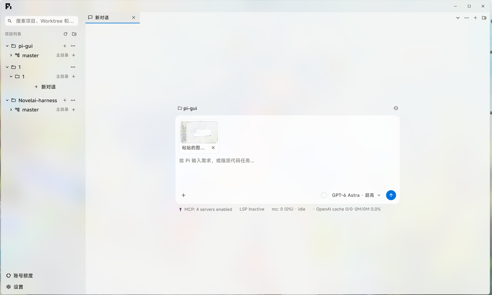
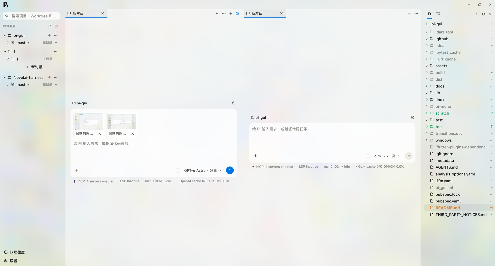
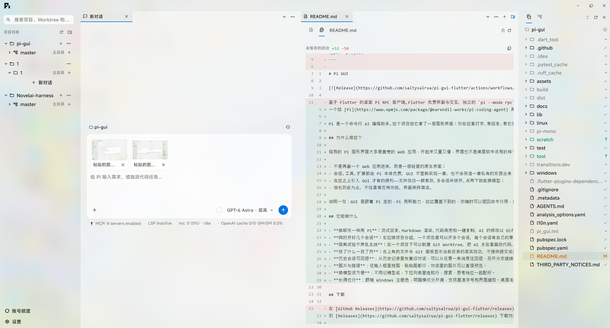

# Pi GUI

[](https://github.com/saltysalrua/pi-gui-flutter/actions/workflows/release.yml)

一个给 [Pi](https://www.npmjs.com/package/@earendil-works/pi-coding-agent) 用的桌面界面，支持 Windows 和 Linux。

Pi 是一个命令行 AI 编程助手。这个项目给它套了一层图形界面：你在这里打字、看回复、看它改了哪些文件，模型、会话和工具执行还是 Pi 自己负责。它不直接调用任何模型 API，所以也没有需要在这里填的 API Key。

## 为什么做这个

现有的 Pi 图形界面大多是套壳的 Web 应用，开起来又重又慢，界面也不是桌面软件该有的样子。我们想要的是一个真正的原生桌面应用：

- 不是再塞一个 Web 应用进来，而是一层轻量的原生界面；
- 会话、工具、扩展都由 Pi 本体负责，GUI 不重新实现一套，也不会另造一套私有的东西出来；
- 在这之上引入 GUI 才有的便利——文件改动一眼看到、多会话并排开、点两下就能换模型；
- 但也到此为止，不往里堆花哨功能，界面保持简洁。

说明一句：GUI 是跟着 Pi 走的，Pi 有新能力、这边覆盖不到的，你随时可以退回命令行用，两边不冲突。

## 它能做什么

- **像聊天一样用 Pi**：流式回复、Markdown 渲染、代码高亮和一键复制，AI 的修改以 Diff 形式贴在对话里。个别情况（并发写入、很早的历史）拿不到旧内容时，只显示写入的内容本身，不硬造对比。
- **同时开好几个会话**：左边按项目分组，一个项目里可以开多个会话，每个会话有自己的草稿、附件和模型设置，切走一个不影响它继续干活。
- **隔离试验不弄乱主线**：在一个项目下可以新建 Git Worktree，把 AI 关在里面改代码，主线目录不受影响。不想要了可以整棵删掉，删除前会做安全检查（还有会话在用、或有未提交改动时会拦下来），删掉的分支仍保留在仓库里，后悔了能找回。
- **改了什么一目了然**：右上角的文件与 Git 面板显示当前目录的真实改动，不提供提交或回滚，只看不动手。
- **历史会话可回退**：从历史记录里恢复旧对话，可以从任意一条消息往回退、另开分支继续。
- **图片与链接**：往输入框里拖图、粘贴图都行，对话里的图片可以直接预览。
- **换模型很方便**：不用记模型名，下拉列表里选就行，搜索、思考档位一起配好。
- **长得也行**：跟随 Windows 主题色，明暗模式分开调，支持基准字号和界面缩放。桌面毛玻璃需要 Windows 11 22H2+，系统不支持时自动退回普通背景。

## 界面预览

### 主界面与图片附件



### 多会话并排与文件浏览



### 对话与文件 Diff 并排



## 下载

到 [Releases](https://github.com/saltysalrua/pi-gui-flutter/releases) 下载对应平台的包：Windows x64 便携 ZIP（解压后运行 `pi_gui.exe`）或 Linux x64 tar.gz。

用之前需要：

1. 安装 Node.js，并加入 PATH；
2. 用 npm 安装 Pi：`npm install -g @earendil-works/pi-coding-agent`；
3. 先在命令行里把 Pi 配置好（模型和登录凭据），这个 GUI 不负责这件事。

程序是便携版，不需要安装；没有做代码签名，Windows 第一次运行时可能要确认一下。Linux 版由 CI 构建，但我们日常只在 Windows 上用，Linux 上遇到问题欢迎提 issue。详细说明见 [便携版使用说明](docs/release_usage.md)。

## 从源码运行

需要 Windows 桌面 Flutter 开发环境（固定 Flutter **3.47.4 / stable**，Dart **3.13.3**）。

```bash
flutter pub get --enforce-lockfile
flutter run -d windows
```

两点提醒：

- 换过 Flutter SDK 之后要完整重新构建再启动，热重载切不了引擎。
- 如果这个 GUI 正在跑着别的 AI 会话，不要随手热重启或关掉它的 Pi 进程，等会话结束再说。

## 开发与验证

```bash
flutter analyze
flutter test

# 不请求模型的接口检查
dart run tool/check_pi_rpc.dart
dart run tool/check_chat_rpc.dart
node tool/check_tool_diff.mjs
node tool/check_workspace_rpc.mjs

# 多进程并行会话验证（同样不请求模型）
node tool/check_parallel_rpc.mjs
node --test test/workspace_manager.test.mjs test/workspace_backend.test.mjs test/workspace_browser_backend.test.mjs

# 会真的调一次模型的端到端检查，消耗额度
dart run tool/check_chat_rpc.dart --with-model
```

日常开发优先热重载。必须热重启时，先关掉旧的 RPC 客户端，免得留下没有清理的 Pi 子进程。

## 发布

改 `pubspec.yaml` 里的 `version` 再推送到 `master`，GitHub Actions 会自动构建 Windows 和 Linux 版并创建 Release；只改代码不动版本号不会触发构建。详见 [GitHub 自动构建与发布](docs/github_release.md)。

## 许可证

项目原创代码采用 [MIT 许可证](LICENSE)，允许商用、修改和再分发，需保留版权与许可声明，软件不提供担保。

第三方代码、字体和图标仍适用各自许可，不因本项目采用 MIT 而改变；尚未确认授权来源的品牌图稿也不在本项目 MIT 授权范围内。详情及待核对项见 [第三方声明](THIRD_PARTY_NOTICES.md)。

## 更多文档

- 使用相关：[便携版使用说明](docs/release_usage.md) · [外观设置](docs/appearance_settings.md) · [对话与文件改动](docs/rpc_chat.md) · [图片与链接](docs/images_and_links.md)
- 功能细节：[工作区与会话](docs/workspaces_sessions.md) · [文档标签页](docs/document_tabs.md) · [文件与 Git 面板](docs/workspace_browser.md) · [历史回退与分支](docs/history_rewind.md) · [模型选择器](docs/model_picker_rpc.md) · [扩展槽位](docs/extension_ui_slots.md)
- 构建相关：[Windows 构建检查](docs/windows_build.md) · [Flutter 版本与渲染器](docs/flutter_renderer.md) · [GitHub 自动发布](docs/github_release.md) · [第三方声明](THIRD_PARTY_NOTICES.md)
- 给协作者：[项目规范](AGENTS.md)